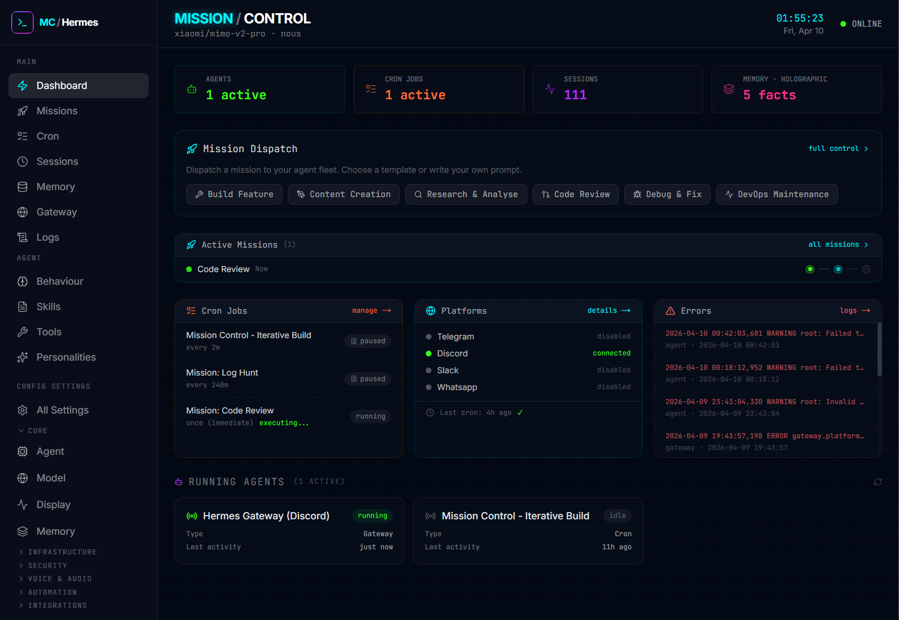

# Hermes Mission Control

A command centre dashboard for [Hermes Agent](https://github.com/NousResearch/hermes-agent). Monitor your agent fleet, dispatch missions, manage configurations, and control everything from one place.



---

## Table of Contents

- [Features](#features)
- [Prerequisites](#prerequisites)
- [Quick Start](#quick-start)
- [User Guide](#user-guide)
  - [The Dashboard](#the-dashboard)
  - [Dispatching Missions](#dispatching-missions)
  - [Cron Jobs](#cron-jobs)
  - [Agent Behaviour](#agent-behaviour)
  - [Configuration](#configuration)
  - [Sessions](#sessions)
  - [Memory](#memory)
  - [Gateway](#gateway)
  - [Skills & Tools](#skills--tools)
  - [Tips](#tips)
- [Architecture](#architecture)
- [Screenshots](#screenshots)
- [Development](#development)
- [License](#license)

---

## Features

| Feature | Description |
|---------|-------------|
| **Dashboard** | Live stats, active missions, system and agent monitoring |
| **Missions** | Dispatch and track agent missions with 6 built-in templates |
| **Agent Behaviour** | Edit SOUL.md, HERMES.md, USER.md, MEMORY.md, AGENTS.md, and masked .env |
| **Config Editor** | Full config.yaml editing with 27 sections and auto-backup |
| **Cron Manager** | Schedule, edit and monitor recurring tasks |
| **Session Browser** | View conversation transcripts across all gateways |
| **Memory CRUD** | Manage holographic memory facts |
| **Skills Browser** | Browse and view installed skills |
| **Tools Manager** | Toggle toolsets per platform (Discord, Telegram, CLI, etc.) |

---

## Prerequisites

- **Node.js** 18 or later
- **Hermes Agent** installed and configured at `~/.hermes/`

---

## Quick Start

```bash
git clone https://github.com/Daniel-Parke/hermes-mission-control.git ~/mission-control
cd ~/mission-control
bash scripts/setup.sh
npm run start:network
```

The dashboard will be available at `http://localhost:3000`.

---

## User Guide

### The Dashboard

Open the dashboard and you instantly know what is happening:

```
┌─────────────────────────────────────────────────────────────┐
│  Top Bar: Model · Provider · Clock · Status                 │
├──────────┬──────────┬──────────┬────────────────────────────┤
│ Agents   │ Cron Jobs│ Sessions │ Memory                     │
│ 1 Active │ 2 Active │ 165      │ holographic · 12 facts     │
├──────────┴──────────┴──────────┴────────────────────────────┤
│  Mission Dispatch — Quick-access to templates               │
├─────────────────────────────────────────────────────────────┤
│  System Monitor — Gateway · Cron Health · Errors            │
├─────────────────────────────────────────────────────────────┤
│  Active Missions — Live progress indicators                 │
├─────────────────────────────────────────────────────────────┤
│  Running Agents — Currently active processes                │
└─────────────────────────────────────────────────────────────┘
```

Everything auto-refreshes every 15 seconds.

---

### Dispatching Missions

Missions are how you give your agent a task — structured prompts with built-in progress tracking.

**Six built-in templates:**

| Template | Use when you need to... |
|----------|------------------------|
| Build Feature | Plan and implement a new feature end-to-end |
| Content Creation | Write documentation, posts, or other content |
| Research & Analyse | Deep research with structured findings and citations |
| Code Review | Review code for bugs, security issues, and improvements |
| Debug & Fix | Reproduce, diagnose, and fix a reported issue |
| DevOps Maintenance | Maintain and improve infrastructure |

You can also create your own templates and save them for reuse.

**Each mission has two parts:**
- **Instruction** — The agent's role and numbered steps (pre-filled by templates)
- **Context** — Specific details for this run (you fill this in)

**Three dispatch modes:**

| Mode | What happens |
|------|-------------|
| Save Draft | Stores the mission without running it |
| Run Now | Creates a one-shot cron job, executes within ~60 seconds |
| Repeating | Creates a scheduled cron job on a repeating interval |

When you dispatch, the mission appears under "Active Missions" with a 3-step progress indicator:

```
[Dispatched] ──→ [Processing] ──→ [Done]
     ●                  ○               ○        ← waiting
     ✓                  ●               ○        ← agent working
     ✓                  ✓               ✓        ← complete
```

Each step lights up as the agent progresses. Failed steps turn red.

**Re-dispatching:** Completed or failed missions can be re-dispatched. Expand the mission detail panel and click "Edit & Re-Dispatch". A new mission is created with the same prompt — the original is preserved.

---

### Cron Jobs

Cron jobs are scheduled tasks that run automatically. Missions create cron jobs under the hood, but you can also manage them directly.

**What you can do:**
- View all jobs with schedule, last run, and next run
- Pause and resume jobs
- Trigger a manual run
- Edit prompts and schedules
- Delete jobs

**Schedule formats:**

```
every 5m          every 15m          every 1h          every 24h
0 */2 * * *       daily at 9am       0 9 * * 1-5       @weekly
```

Job results are delivered to your configured Discord channel (`DISCORD_HOME_CHANNEL` in `.env`).

---

### Agent Behaviour

Navigate to `Agent -> Behaviour` to edit the files that shape how your agent thinks and acts:

| File | Purpose |
|------|---------|
| SOUL.md | Personality, tone, communication style |
| HERMES.md | Priority project instructions (highest priority context) |
| USER.md | Your preferences, priorities, personal details |
| MEMORY.md | The agent's curated memories |
| AGENT.md | Agent instructions and behaviour guidelines |
| .env | Environment variables (keys masked as `sk-...abcd`) |
| AGENTS.md | Project conventions (auto-scanned from directories) |

Changes take effect on the agent's next session. No restart required.

---

### Configuration

Navigate to `Config Settings -> All Settings` for full control over 27 sections:

**Core** — Agent behaviour, model selection, display settings, memory provider

**Infrastructure** — Terminal backends, compression, browser, checkpoints

**Security** — Safety rules, privacy, approval modes

**Voice & Audio** — TTS, STT, voice settings

**Automation** — Delegation, cron defaults, session reset

**Integrations** — Platform-specific settings

Every section shows which fields are configured and which use defaults. Changes save to `~/.hermes/config.yaml` with automatic backup.

---

### Sessions

Browse every conversation your agent has had across all platforms (Discord, Telegram, CLI, etc.).

- Sort by most recent
- See session source and file size
- Click to expand the full transcript with colour-coded messages
- Filter by role (User, Assistant, Tool)
- Collapsible tool outputs with summaries

---

### Memory

If you have Holographic Memory installed, the Memory page lets you browse, search, add, edit, and delete memory facts.

```bash
hermes plugins install hermes-memory-store
```

Facts are extracted automatically during conversations (when `auto_extract` is enabled) or added manually. Each fact has a category, tags, and trust score.

> **Note:** If Holographic Memory is not installed, the page shows a helpful notice with install instructions instead of crashing.

---

### Gateway

The Gateway page shows which messaging platforms are connected:

| Platform | Status indicators |
|----------|------------------|
| Discord | Connected / Not configured |
| Telegram | Connected / Not configured |
| Slack | Connected / Not configured |
| WhatsApp | Connected / Not configured |

Connected platforms show a green indicator with pulse animation.

---

### Skills & Tools

- **Skills** (`Agent -> Skills`) — Browse all installed skills with their documentation. Skills are on-demand knowledge documents the agent loads when needed.
- **Tools** (`Agent -> Tools`) — Toggle which toolsets are available per platform. Disable browser access on Discord but keep it on CLI? This is where you do it.

---

### Tips

> **Auto-refresh** — Dashboard and cron pages auto-refresh every 15 seconds. No need to manually reload.

> **Toast notifications** — All actions produce confirmation toasts. They stay visible for 4 seconds.

> **Destructive actions** — Deleting missions, cron jobs, or memories always requires confirmation.

> **Network access** — Use `npm run start:network` to access the dashboard from other devices on your LAN.

> **Memory optional** — The dashboard works fully without Holographic Memory. You will see "Not Installed" instead of crashing.

---

## Architecture

| Layer | Technology |
|-------|-----------|
| Framework | Next.js 16 (App Router) + TypeScript + Tailwind CSS |
| Data | Direct file I/O on `~/.hermes/` + SQLite for memory |
| API | RESTful routes under `/api/` |
| State | React hooks (no external state management) |
| YAML | js-yaml for all config parsing |

All API routes import paths from `src/lib/hermes.ts` for consistency. The app reads from `~/.hermes/` but never writes to `config.yaml` directly.

---

## Screenshots


---

## Development

```bash
npm run dev           # Start dev server with hot reload
npm run build         # Production build
npm run test          # Run test suite (63 tests)
npm run start         # Production server (localhost only)
npm run start:network # Production server (accessible on LAN)
```

**Data storage:** Missions and custom templates are stored at `~/.hermes/mission-control/data/`. This keeps your data portable — it travels with your Hermes config, not the app directory.

**Environment variables** (optional, in `.env`):

| Variable | Default | Description |
|----------|---------|-------------|
| `HERMES_HOME` | `~/.hermes` | Path to Hermes home directory |
| `PORT` | `3000` | Server port |

---

## License

MIT
