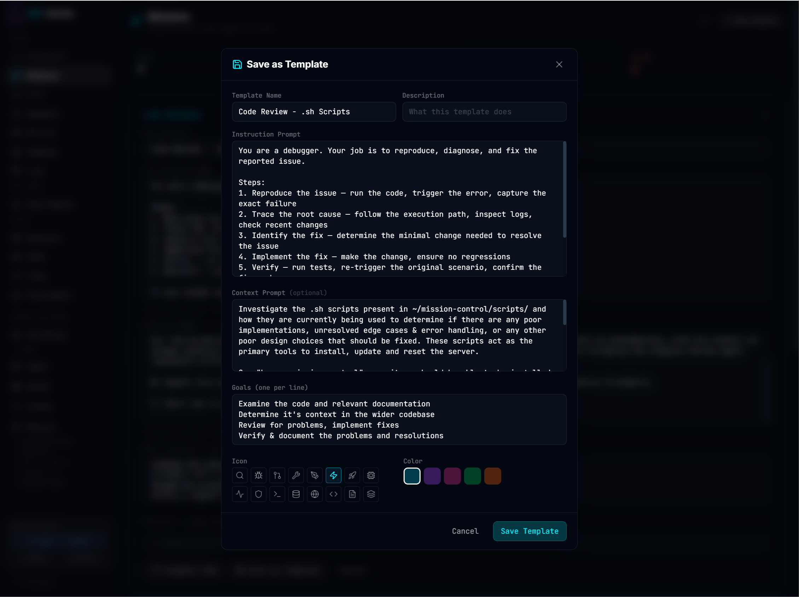
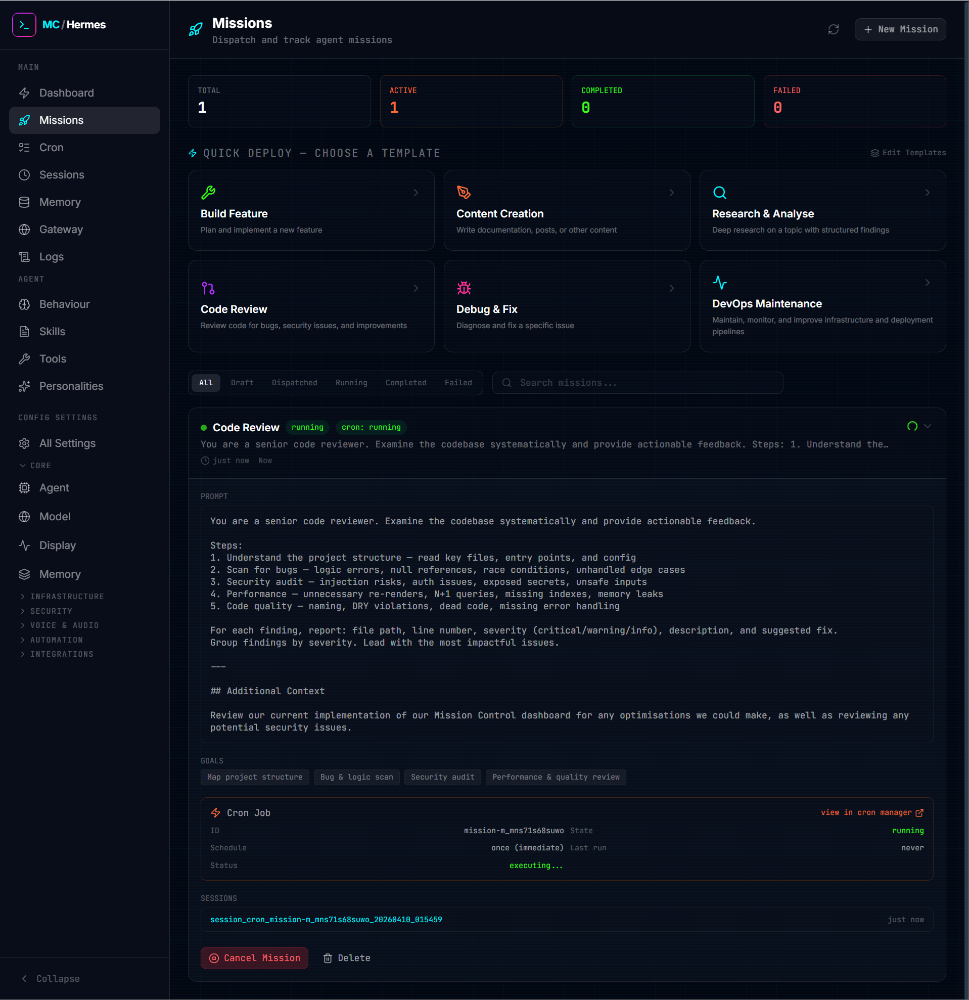
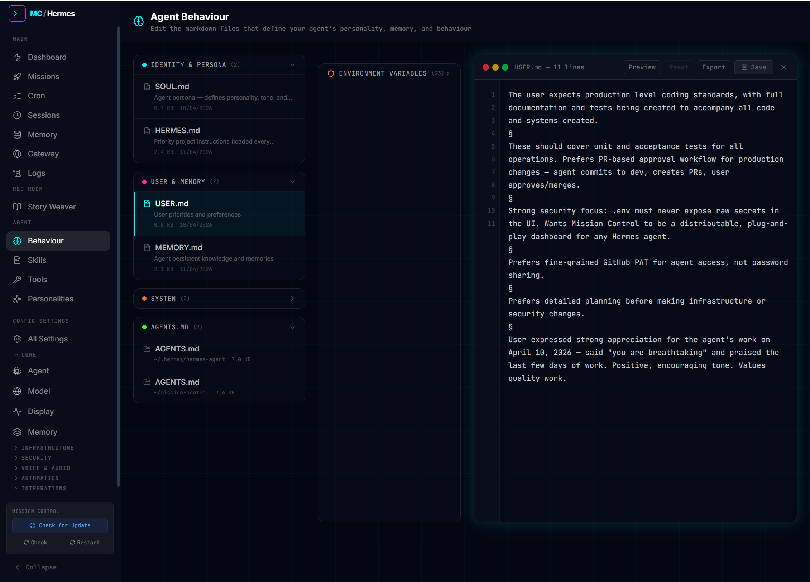
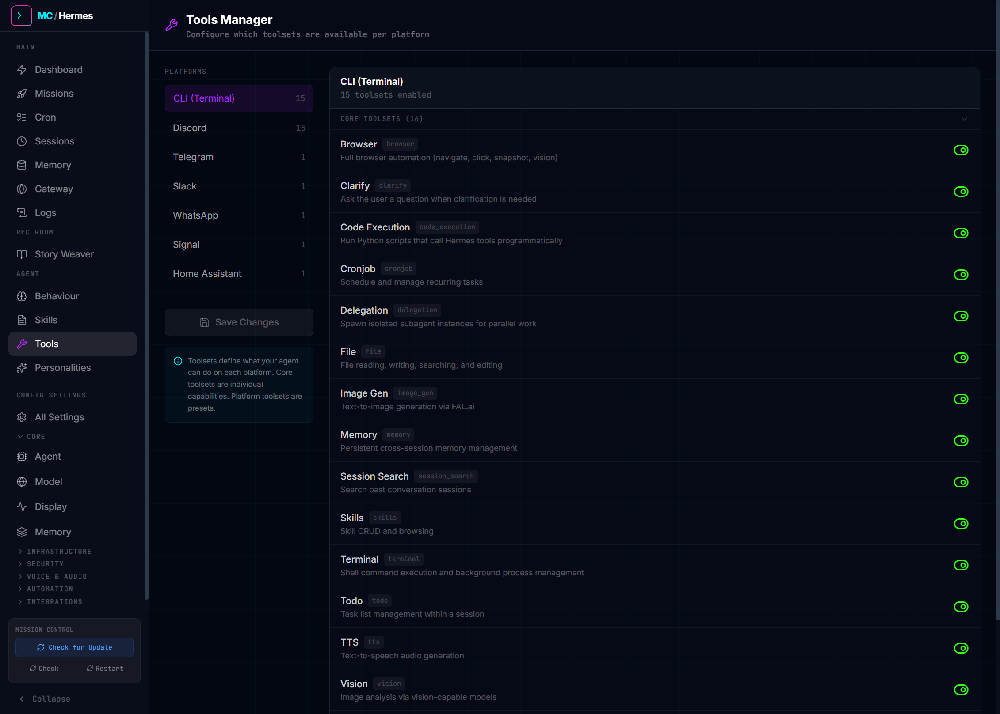

# Hermes Mission Control

A command centre dashboard for [Hermes Agent](https://github.com/NousResearch/hermes-agent). Monitor your agent fleet, dispatch missions, manage configurations, and control everything from one place.


---

## Features

| Feature | Description |
|---------|-------------|
| **Dashboard** | Live stats, active missions, system health, agent monitoring |
| **Missions** | Dispatch and track agent missions with built-in templates |
| **Story Weaver** | Collaborative AI fiction — create worlds, write chapters, build stories |
| **Cron Manager** | Schedule, edit, and monitor recurring tasks |
| **Agent Behaviour** | Edit SOUL.md, HERMES.md, AGENTS.md, and more |
| **Config Editor** | Full config.yaml editing with 27 sections |
| **Session Browser** | View conversation transcripts across all gateways |
| **Memory** | Manage holographic memory facts |
| **Skills & Tools** | Browse skills, toggle toolsets per platform |
| **Gateway** | Monitor platform connections (Discord, Telegram, etc.) |

---

## Quick Start

```bash
# Clone and install
git clone https://github.com/Daniel-Parke/hermes-mission-control.git ~/mission-control
cd ~/mission-control
bash scripts/install.sh
```

Or install without cloning:

```bash
bash <(curl -s https://raw.githubusercontent.com/Daniel-Parke/hermes-mission-control/main/scripts/install.sh)
```

The dashboard will be available at `http://localhost:3000`.

---

## Prerequisites

- **Node.js** 18+
- **Hermes Agent** installed at `~/.hermes/` (run `hermes update` first)

---

## User Guide

### The Dashboard

The dashboard is your command centre. At a glance you see:

- **System status** — model, provider, uptime, gateway connection
- **Active missions** — currently running agent tasks
- **Cron jobs** — scheduled tasks with status
- **Running agents** — all active agents with last activity
- **Memory** — holographic memory facts and provider status
- **Errors** — recent log entries for quick triage
- **Rec Room** — quick access to Story Weaver

Everything auto-refreshes every 10 seconds.

---

### Dispatching Missions

Click any template to dispatch instantly, or write a custom prompt. Missions appear under "Active Missions" with a status badge:

| Status | Colour | Meaning |
|--------|--------|---------|
| **Queued** | Orange | Cron job created, waiting for scheduler |
| **Dispatched** | Blue | Agent is working |
| **Successful** | Green | Completed successfully |
| **Failed** | Red | Error or cancelled |

---

### Cron Jobs

Schedule recurring tasks: every 15m, every 2h, cron expressions, or one-shot at a specific time. Jobs run autonomously and deliver results to your configured platform.

### Agent Behaviour

Edit the files that define your agent's personality and rules:
- **SOUL.md** — personality traits
- **HERMES.md** — priority instructions
- **AGENTS.md** — development context
- **USER.md** — user profile

---

### Configuration

Edit `config.yaml` with 27 organised sections. Changes are validated before saving and a backup is created automatically.

### Sessions

Browse conversation transcripts across all gateway platforms. Filter by platform, search by content, and view full message histories.

---

### Memory

Create, edit, search, and delete holographic memory facts. The memory system helps your agent remember context across sessions.

**Note:** Mission Control supports the [Holographic Memory](https://github.com/NousResearch/hermes-agent) plugin. If holographic memory is not installed, the Memory page will show an install notice and the dashboard will display "Not Installed" — the rest of the dashboard continues to work normally.

---

## Story Weaver (WIP)

Collaborative interactive fiction powered by your agent. Create stories from 8 pre-built templates or build your own from scratch.

**Create a story:**
1. Navigate to **Rec Room → Story Weaver**
2. Click **Create New Story**
3. Choose a template or configure manually (title, genre, era, mood, characters, chapter length)
4. Click **Begin Writing**
5. The AI generates a story plan and first chapter (~20 seconds)
6. You're taken to the story reader

**Reading:**
- Continuous scroll with book-like styling
- Customisable reading experience (font, size, spacing, page theme) via the **Aa** button
- Chapters sidebar with read status indicators (blue/orange/green dots)
- Next/Previous chapter navigation with chapter titles

**Features:**
- 8 story templates (Sci-Fi, Mystery, Fantasy, Crime, Romance, Horror, Historical, Children's)
- Tag-based genre/era/mood/setting with custom tags
- Configurable chapter word count (800 words to 5000+)
- Auto-save and auto-generation of next chapters
- Kindle-style reading settings (font, size, theme, spacing)
- Library with full CRUD

---

## Managing Mission Control Dashboard

### Install

```bash
# Standalone installer (auto-clones):
bash <(curl -s https://raw.githubusercontent.com/Daniel-Parke/hermes-mission-control/main/scripts/install.sh)

# Or from a clone:
cd mission-control
bash scripts/install.sh
```

The installer checks prerequisites, detects existing installations, and prompts before overwriting.

### Update

**From the sidebar:** Click "Check" to check for updates. If available, click "Update Now".

**From the terminal:**

```bash
cd ~/mission-control
bash scripts/update.sh
```

The update script fetches from `origin/main`, builds, and restarts. If the build fails, the update aborts without restarting.

### Restart

**From the sidebar:** Click the "Restart" button.

**From the terminal:**

```bash
cd ~/mission-control
bash scripts/restart.sh
```

### Troubleshooting

**Server won't start (port 3000 in use):**

```bash
fuser -k 3000/tcp
npm run start:network
```

**Build fails after update:**

```bash
cat ~/.hermes/logs/mc-update.log
cd ~/mission-control
npm run build
bash scripts/restart.sh
```

**Gateway not running (no cron jobs executing):**

```bash
systemctl --user status hermes-gateway
systemctl --user start hermes-gateway
```

**Gateway API not available (Story Weaver won't generate):**

Ensure `API_SERVER_ENABLED=true` is in `~/.hermes/.env`, then restart the gateway.

**Reset to clean state:**

```bash
cd ~/mission-control
git checkout main
git reset --hard origin/main
npm install
npm run build
bash scripts/restart.sh
```

---

## Architecture

| Layer | Technology |
|-------|-----------|
| Framework | Next.js 16 (App Router) + TypeScript + Tailwind CSS |
| Data | Direct file I/O on `~/.hermes/` + SQLite for memory |
| API | RESTful routes under `/api/` |
| State | React hooks (no external state management) |
| Fonts | Literata, EB Garamond, Lora, Merriweather (Google Fonts) |
| LLM | Gateway API Server at `localhost:8642` (OpenAI-compatible) |

All API routes import paths from `src/lib/hermes.ts`. The app reads from `~/.hermes/` but never writes to `config.yaml` directly.

---

## 📸 Screenshots

Explore the core interfaces of the **Hermes Agent Mission Control** platform below.

---

### 🧭 Main Dashboard


**Central command hub for your entire system**

Monitor active agents, track mission progress, review system health, and quickly navigate to key areas.

---

### 🚀 Mission Dispatch


**Create and launch missions with precision**

Configure mission parameters, assign agents, and dispatch tasks in real time.

---

### 🧩 Mission Template



**Reusable blueprints for repeatable workflows**

Standardize common operations and reduce setup time for recurring tasks.

---

### 📄 Mission Page



**Detailed mission execution view**

Access status, logs, outputs, and performance metrics in one place.

---

### ⏱️ Cron Jobs


**Automate recurring missions**

Manage scheduled workflows with full lifecycle visibility.

---

### 🧠 Agent Behaviour



**Define agent logic and responses**

Control decision-making patterns and behavioural rules.

---

### 🎭 Agent Personalities


**Customize interaction styles**

Shape how agents communicate and behave across missions.

---

### 🛠️ Agent Skills


**Extend agent capabilities**

Configure the actions and functions available to agents.

---

### 🔌 Agent Tools



**Integrations and external tooling**

Manage tools and third-party services agents can use.

---

### ⚙️ Agent Configuration


**Full agent control panel**

Adjust permissions, capabilities, and operational settings.
---

## Development

```bash
npm run dev           # Start dev server with hot reload
npm run build         # Production build
npm run test          # Run test suite (87 tests)
npm run start         # Production server (localhost only)
npm run start:network # Production server (accessible on LAN)
```

**Data storage:** Missions, stories, and custom templates are stored at `~/.hermes/mission-control/data/`.

**Environment variables** (optional, in `.env`):

| Variable | Default | Description |
|----------|---------|-------------|
| `HERMES_HOME` | `~/.hermes` | Path to Hermes home directory |
| `PORT` | `3000` | Server port |
| `API_SERVER_ENABLED` | `true` | Enable Gateway API for Story Weaver |

---

## License

MIT
