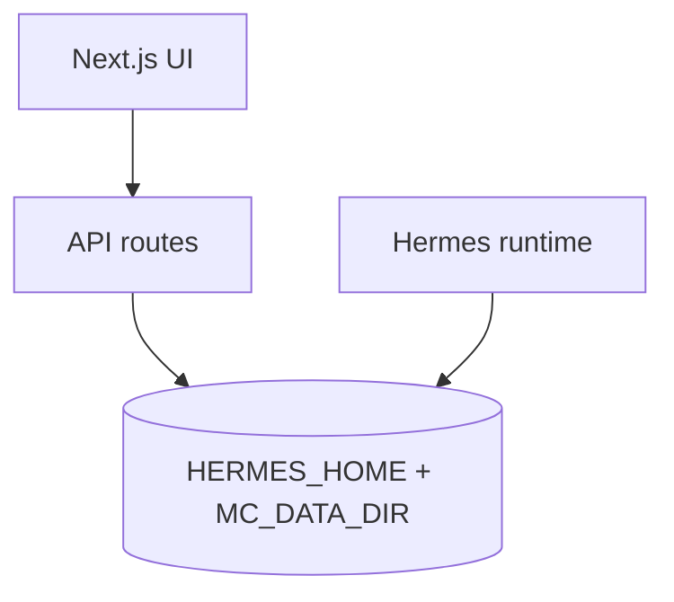

# Command Hub platform vision (OSS)

Command Hub is the **Next.js control plane** for [Hermes Agent](https://github.com/NousResearch/hermes-agent): missions, cron, configuration, sessions, memory, and day-to-day operator workflows. Execution remains in **Hermes** (gateway, scheduler). This app edits Hermes and Command Hub JSON through audited REST routes.

## Architecture (layers)

- **`HERMES_HOME`** (`~/.hermes`): `config.yaml`, `cron/jobs.json`, sessions, skills, logs.
- **`MC_DATA_DIR`** (default `~/command-hub/data`): missions, templates, stories, Rec Room data, and other JSON used by this build. Some directory names may exist for compatibility with broader Hermes tooling; **this OSS app only ships UIs and APIs present in the repository** (see [OSS_SCOPE.md](OSS_SCOPE.md)).

## Scheduling

- Cron jobs are rows in **`HERMES_HOME/cron/jobs.json`**. Command Hub uses a file lock compatible with Hermes.
- Recurring jobs use **`repeat.times: null`** for infinite runs (Hermes canonical).
- **`parseSchedule`** accepts simple intervals, ISO one-shots, and five- or six-field cron strings; invalid input is rejected on user-facing routes.

## Core features in OSS

| Area | Role |
|------|------|
| Model / provider | `GET`/`PUT /api/config/model` — validated updates, masked keys, audit. |
| Missions | CRUD, dispatch, templates (built-in set in OSS). |
| Cron | CRUD against Hermes `jobs.json`. |
| Config / sessions / memory / gateway / logs / skills / personalities | Hermes-aligned surfaces as shipped in this repo. |

An extended edition with additional operator workflows may exist separately from this repository; it is not documented here.

## Security

- Mutating routes use **`MC_API_KEY`** when set (`src/lib/api-auth.ts`).
- Config writes use whitelisted sections; model updates go through **`/api/config/model`**.

## Related docs

- [MIGRATION.md](../MIGRATION.md) — data directory migration.
- [DEPLOY.md](DEPLOY.md) — host, port, TLS, Docker.
- [HERMES_CONFIG_INTEGRATION.md](HERMES_CONFIG_INTEGRATION.md) — optional `hermes-config` checklist.
